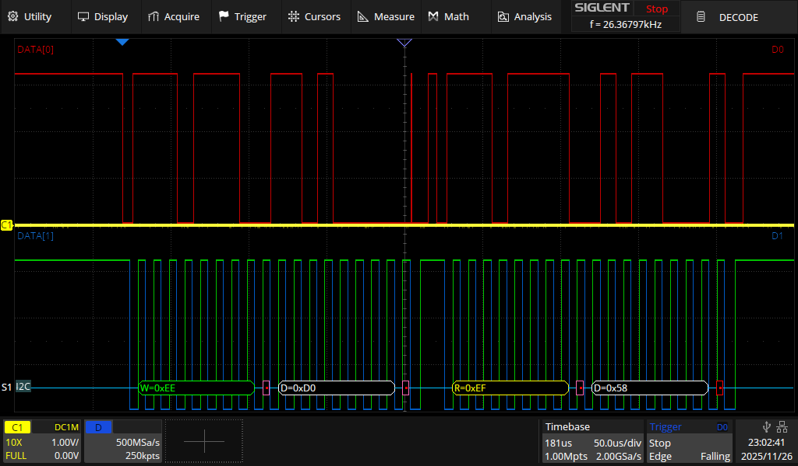
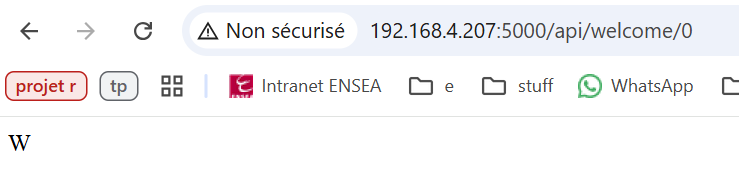
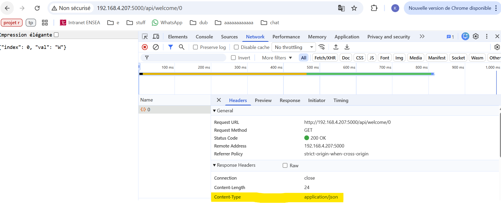
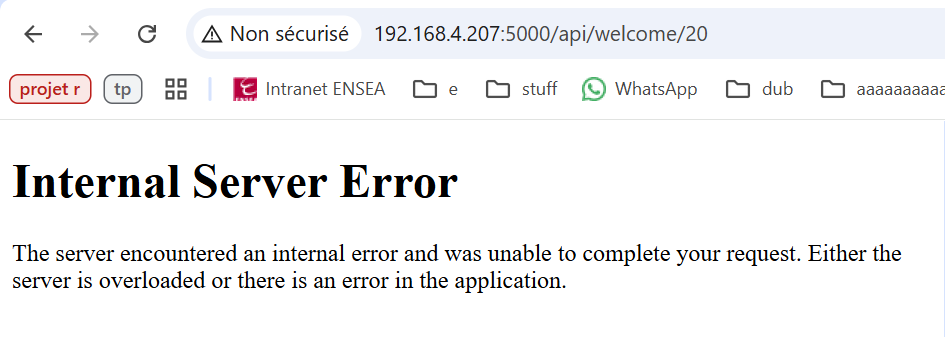

# 2526_ESE_BusEtReseau_XIA_LUO

##  TP 1 - Bus I2C

### 2.1. Capteur BMP280

1. Addresse I2C du composant : 111011x (x dépend de SDO)
   - **dans notre cas : 0b1110111, 0x77**
   - en écriture : 11101111
   - en lecture : 11101110
3. Pour identifier le composant : registre 'id', 0xd0
4. Pour place le composant en mode normal : registre 'ctrl_meas', 0xf4 (bit 1, 0)
5. Registres contenant l'étalonnage (trimming) du composant :
   - dig_T1 : 0x88/0x90 (registre LSB/MSB)
   - dig_T2 : 0x81/0x8B
   - dig_T3 : 0x8C/0x8D
   - dig_P1 : 0x8E/0x8F
   - dig_P2 : 0x90/0x91
   - dig_P3 : 0x92/0x93
   - dig_P4 : 0x94/0x95
   - dig_P5 : 0x96/0x97
   - dig_P6 : 0x98/0x00
   - dig_P7 : 0x9A/0x9B
   - dig_P8 : 0x0C/0x9D
   - dig_P9 : 0x9E/0x9F
   - réservé 0xA0/0xA1
6. Registres contenant la température du composant :
   - 'temp_msb' : 0xfa
   - 'temp_lsb' : 0xfb
   - 'temp_xlsb' : Oxfc (bit 7, 6, 5, 4)
7. Registres contenant la pression :
   - 'press_msb' : 0xf7
   - 'press_lsb' : 0xf8
   - 'press_xlsb' : Oxf9 (bit 7, 6, 5, 4)

8. ```
   // Returns temperature in DegC, resolution is 0.01 DegC. Output value of “5123” equals 51.23 DegC.
   // t_fine carries fine temperature as global value
   BMP280_S32_t t_fine;
   BMP280_S32_t bmp280_compensate_T_int32(BMP280_S32_t adc_T)
   {
       BMP280_S32_t var1, var2, T;
       var1  = ((((adc_T>>3) – ((BMP280_S32_t)dig_T1<<1))) * ((BMP280_S32_t)dig_T2)) >> 11;
       var2  = (((((adc_T>>4) – ((BMP280_S32_t)dig_T1)) * ((adc_T>>4) – ((BMP280_S32_t)dig_T1))) >> 12) * ((BMP280_S32_t)dig_T3)) >> 14;
       t_fine = var1 + var2;
       T  = (t_fine * 5 + 128) >> 8;
       return T;
   }
   
   // Returns pressure in Pa as unsigned 32 bit integer. Output value of “96386” equals 96386 Pa = 963.86 hPa
   BMP280_U32_t bmp280_compensate_P_int32(BMP280_S32_t adc_P)
   {
       BMP280_S32_t var1, var2;
       BMP280_U32_t p;
       var1 = (((BMP280_S32_t)t_fine)>>1) – (BMP280_S32_t)64000;
       var2 = (((var1>>2) * (var1>>2)) >> 11 ) * ((BMP280_S32_t)dig_P6);
       var2 = var2 + ((var1*((BMP280_S32_t)dig_P5))<<1);
       var2 = (var2>>2)+(((BMP280_S32_t)dig_P4)<<16);
       var1 = (((dig_P3 * (((var1>>2) * (var1>>2)) >> 13 )) >> 3) + ((((BMP280_S32_t)dig_P2) * var1)>>1))>>18;
       var1 =((((32768+var1))*((BMP280_S32_t)dig_P1))>>15);
       if   (var1 == 0)
       {
           return 0; // avoid exception caused by division by zero
       }
       p = (((BMP280_U32_t)(((BMP280_S32_t)1048576)-adc_P)-(var2>>12)))*3125;
       if   (p < 0x80000000)
       {
           p = (p << 1) / ((BMP280_U32_t)var1);
       }
       else
       {
           p = (p / (BMP280_U32_t)var1) * 2;
       }
       var1 = (((BMP280_S32_t)dig_P9) * ((BMP280_S32_t)(((p>>3) * (p>>3))>>13)))>>12;
       var2 = (((BMP280_S32_t)(p>>2)) * ((BMP280_S32_t)dig_P8))>>13;
       p = (BMP280_U32_t)((BMP280_S32_t)p + ((var1 + var2 + dig_P7) >> 4));
       return p;
   } 
   ```

### 2.3. Communication I²C

- Identification du BMP280



## TP3 - Interface REST

### 4.1. Installation du serveur Python

```
xia@pi-xia:~ $ curl -s -D - http://127.0.0.1:5000
HTTP/1.1 200 OK
Server: Werkzeug/3.1.4 Python/3.13.5
Date: Thu, 04 Dec 2025 09:41:53 GMT
Content-Type: text/html; charset=utf-8
Content-Length: 14
Connection: close

Hello, World!
```


### 4.2. Première page REST

- **`@approute`**, sert à lier une URL à une fonction python

  

- **`<int:index>`**, sert à capturer une partie de l'URL et la passer en argument de la fonction

  

### 4.3. Nouvelles métodes HTTP

 


